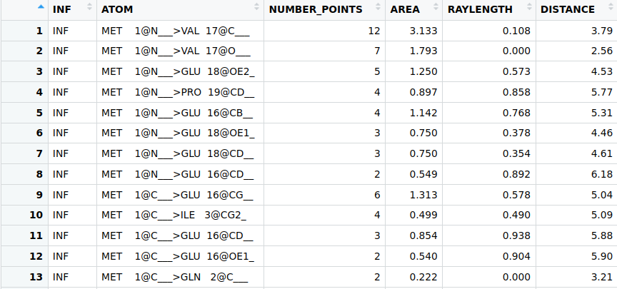

# OS - OCCLUDED SURFACE PACKAGE
## Description
The OS package was developed with the objective to offer in R the Occluded Surface methodology, created by Patrick Fleming and coauthors [Pattabiraman, Ward, & Fleming, 1995]
## Functionalities
The package allows the calculation of occluded surface areas between atoms of a molecule, using as input a PDB code or PDB file. 
## Requirements
Firstly, it is necessary to have devtools installed:

    install.packages(“devtools”)

Note: These additional libraries are also required:
  * bio3d
  * dplyr
  * readr
  * stringr
  * tidyr

## How use
### Installing the Package

    library(devtools)\
    install_github("https://github.com/hersonhebert/os")  

### Using the Package:

In this beta version, only two functions were implemented: occluded_surface and read_OS.

    library(byo3d)\
    library(dplyr)\
    library(readr)\
    library(stringr)\
    library(tidyr)\
    m = occluded_surface(pdb, method)

The function is responsible for computing the occluded areas between atoms and returning the results as a tibble/data frame. Additionally, it generates the prot.srf file as a side effect.

Regarding the parameters:

  - pdb: this can either be the code or path/file of the PDB that represents a protein. If you wish to obtain the file online from the RCSB PDB site, simply enter the PDB code. If the file is saved locally, enter the file path.

  - method: this parameter determines the method used to calculate the occluded areas between atoms. Accepts the strings "OS" (tradicional) or "FIBOS" (experimental) 

    m = read_OS(file)

  - file: the path to the prot.srf file.

## Examples

    m = occluded_surface("1ppf", method = "OS")
    m = read_OS("prot.srf")

### Function return (occluded_surface and read_OS):

## Authors

- Carlos Henrique da Silveira:  carlos.silveira@unifei.edu.br
- Herson Hebert Mendes Soares: d2020102075@unifei.edu.br

## References

Pattabiraman, N., Ward, K. B., & Fleming, P. J. (1995). Occluded molecular surface: Analysis of protein packing. Journal of Molecular Recognition, 8, 334–344. https://doi.org/doi.org/10.1002/jmr.300080603

## Status
In Progress.
